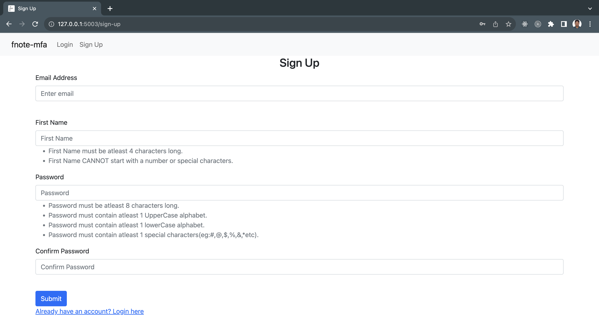
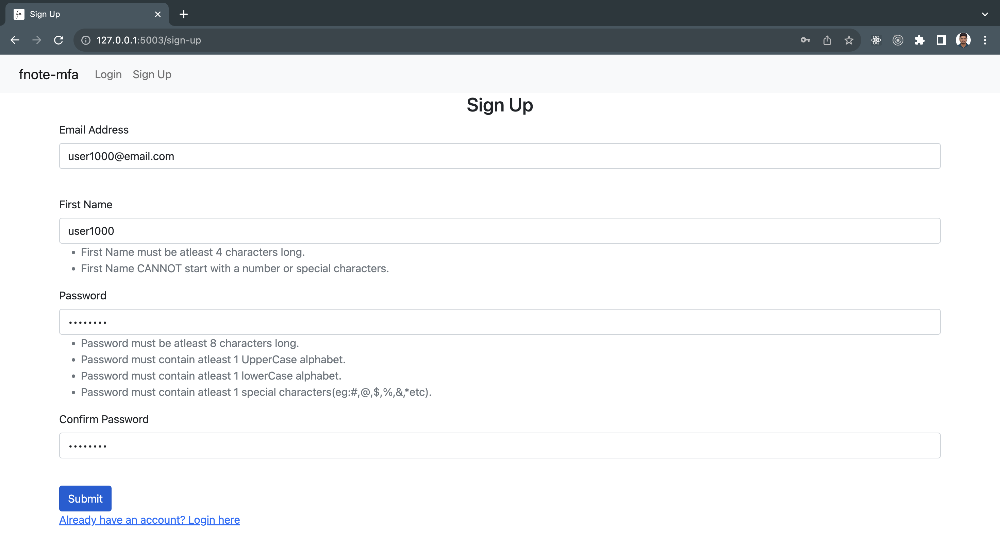
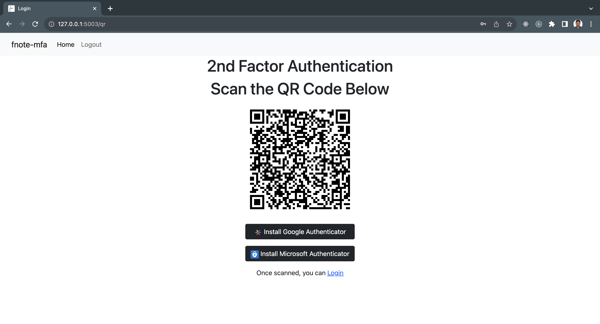
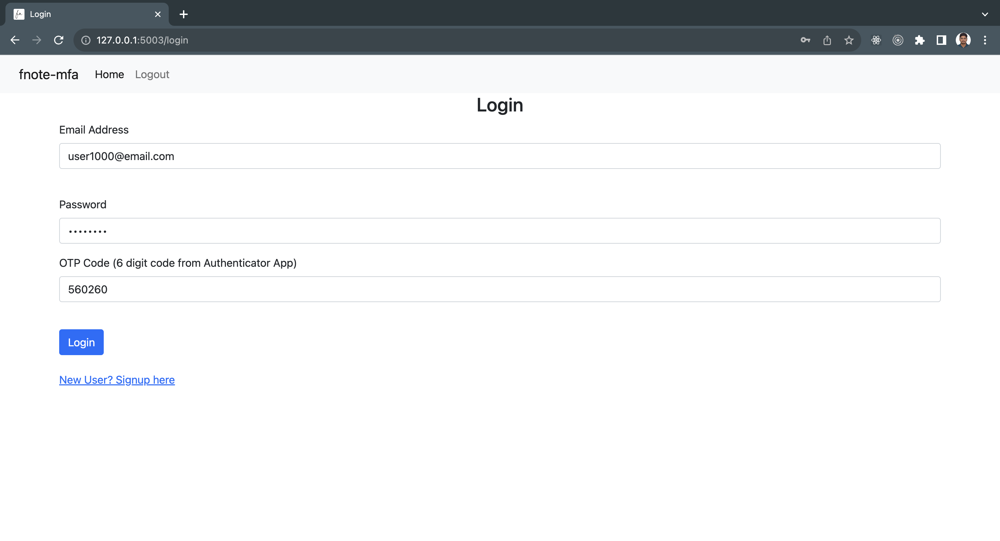
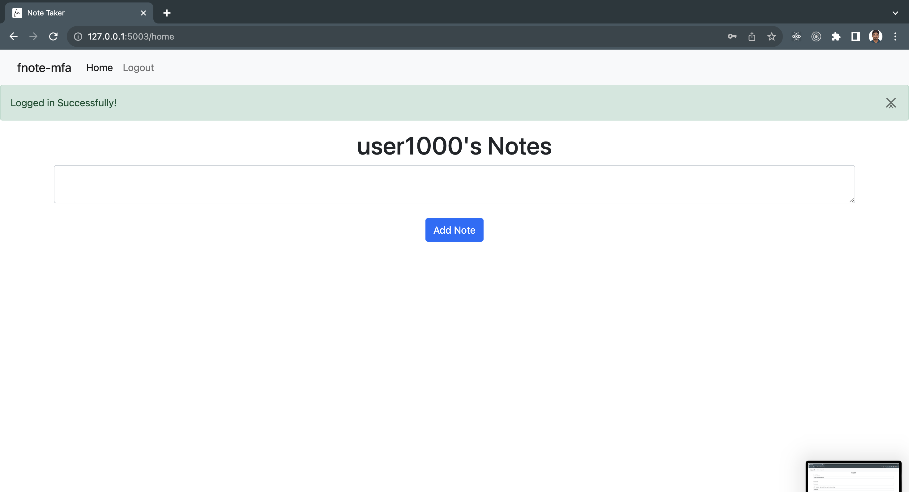

# e-jotter

Minimal Note Taking App with Multi-factor Autentication enabled

# Access Live Project [Not Working, Taken down to save Cloud Billing Cost]

```
https://fnote-mfa-p6erx5zvlq-uw.a.run.app/login
```


# Run the app on Docker

1. Pull the docker image from docker hub

```
# docker pull riyadorkadi/fnote-mfa
```

2. Run the docker image (on arm64 (ie., Mac M1, M2))

```
docker run --name fnote-mfa-cont01 -dit -p 5001:5000 riyadorkadi/fnote-mfa:latest
```

To run docker image on amd64 or x86_64 (ie., On AWS EC2, Intel etc)

```
docker run --name fnote-mfa-cont01 -dit -p 5001:5000 riyadorkadi/fnote-mfa-amd64:latest
```

Check dockerhub for more details: https://hub.docker.com/r/riyadorkadi/fnote-mfa 

3. Open the app in browser

```
http://localhost:5001/
```

# To run locally 

1. Clone this repo 

2. Create a virtual environment and install the dependent packages

```
# virtualenv venv

# source venv/bin/activate

# pip3 install -r requirements.txt

# python3 main.py
```

## Sample images











## Functionalities

- Create a new user (Signup)
- Multi-factor Authentication (Using TOPT)
- Login only for signed up user (Login and Logouts)
- Create notes (NOT shared notes, each user can only see his notes)
- Delete notes (Only registerd users can delete/create notes)
- Cannot see other users notes
